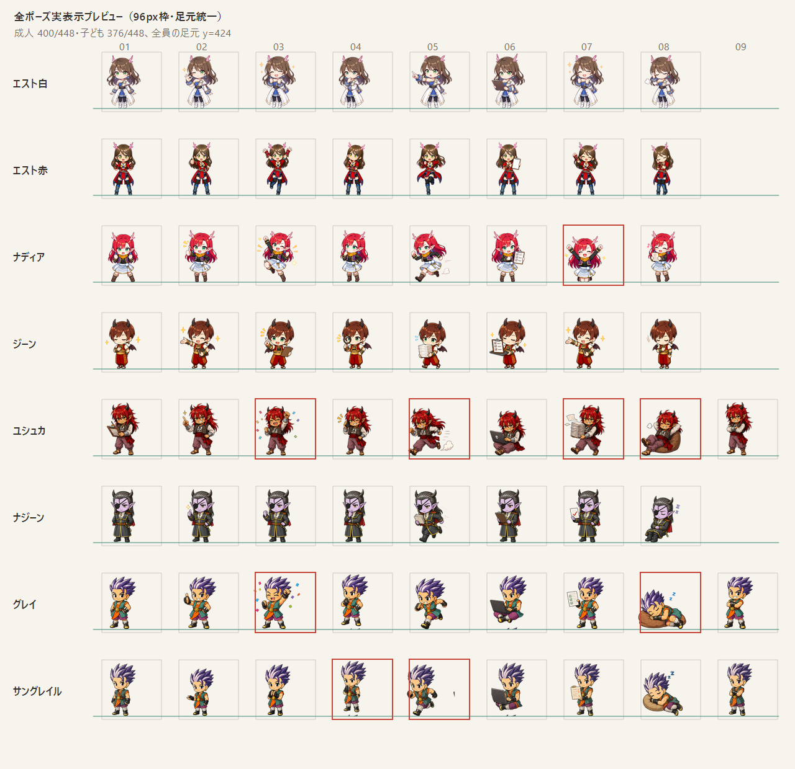
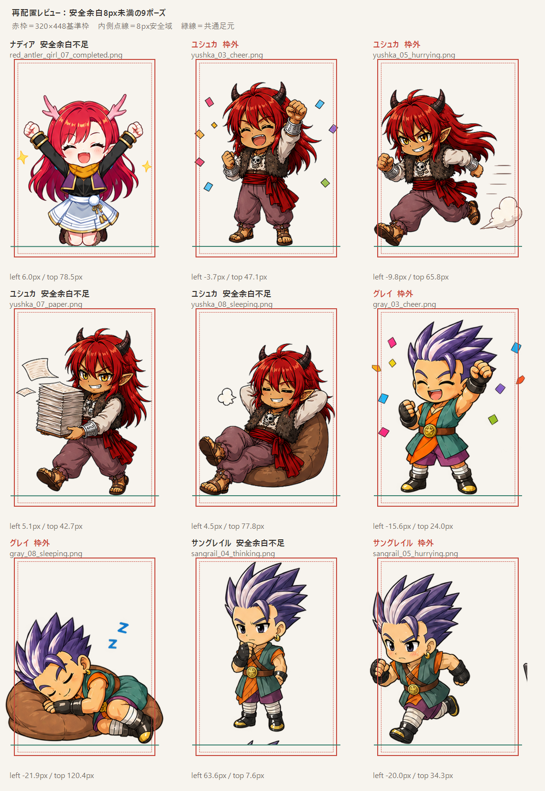

# ちびキャラ全ポーズ正規化レビュー v0.4

## 結論

- 共通キャンバスは `320 × 448 px` のままで進められる。
- 接地位置は全キャラ共通で `y = 424 px` とする。
- 大人組はneutralの描画高400 px、子ども組（ナディア・ジーン）は376 pxとする。
- 66ポーズ中57ポーズは、この倍率をそのまま使っても8 px安全域へ収まる。
- 9ポーズは個別確認が必要。そのうち実際に枠外へ出るものは5ポーズ。
- 立ちポーズは足裏、座り・睡眠ポーズは椅子やクッションを含む最下端を接地位置へ合わせる。

## 再配置対象

| キャラクター | ポーズ | 状態 | 原因 | 対応案 |
| --- | --- | --- | --- | --- |
| ナディア | 07 完了 | 安全余白6.1 px | 左右の星 | 星を中央へ2 px寄せる。人物倍率は維持 |
| ユシュカ | 03 喜び | 左右3.8 px枠外 | 紙吹雪 | 紙吹雪だけ内側へ移動。人物倍率は維持 |
| ユシュカ | 05 急ぎ | 左右9.8 px枠外 | 走り姿勢と煙 | 煙と速度線を詰め、必要なら全体を最大2%だけ縮小 |
| ユシュカ | 07 紙 | 安全余白5.1 px | 飛んだ紙 | 紙だけ内側へ移動。人物倍率は維持 |
| ユシュカ | 08 睡眠 | 安全余白4.5 px | クッション | 2〜3%縮小、またはクッションだけ少し狭める |
| グレイ | 03 喜び | 左右15.7 px枠外 | 紙吹雪 | 紙吹雪だけ内側へ移動。人物倍率は維持 |
| グレイ | 08 睡眠 | 左右21.8 px枠外 | 横長のクッションと寝姿 | クッションを狭めて再構成。単純縮小は最終手段 |
| サングレイル | 04 思案 | 上余白7.6 px | 画像下端に別パーツの切れ端 | 切れ端を除去して再計測 |
| サングレイル | 05 急ぎ | 左右20.0 px枠外 | 画像右端に別パーツの切れ端 | 切れ端を除去して再計測。人物本体は維持 |

## 頭身とサイズの運用ルール

1. キャラクターごとの倍率はneutralで決め、通常の立ちポーズ間では変えない。
2. 腕上げなどで全高が伸びても、頭や体そのものを小さくしない。
3. 紙吹雪・星・紙・煙は人物とは別扱いにし、まず演出物を安全域内へ移す。
4. 座り・睡眠など横長になるポーズだけは、接地位置を維持したまま個別の構図調整を許可する。
5. 個別縮小が必要な場合も3%以内を目安とし、それを超える場合は描き直し・再構成を優先する。
6. キャラ選択画面にはneutralのみを使い、全員の足裏を同じ位置へ置く。
7. 大人組と子ども組の差は描画高24 px（約6%）とし、横幅ではなく身体の長さで表現する。

## 次の実装単位

1. サングレイル04・05の不要な切れ端を除去する。
2. 演出物だけが原因の5ポーズを、安全域内へ再配置する。
3. ユシュカ08・グレイ08の横長構図を調整する。
4. 全ポーズを320 × 448 pxへ書き出し、96 px・124 px表示で再確認する。
5. 問題がなければ、アプリの画像参照先を正規化済みセットへ切り替える。

対象9枚の修正結果は [はみ出し修正レビュー v0.5](chibi-overflow-fix-review-v5.md) に続く。
