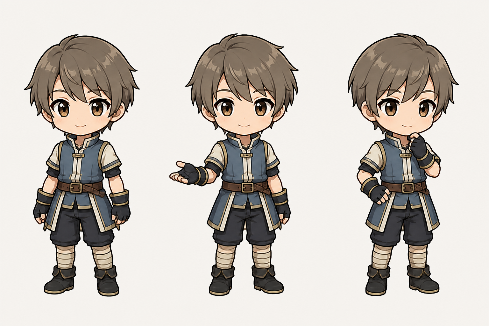

# ちびキャラ共通フォーマット たたき台 v0.1



子ども組・大人組のサイズ差と共通の足元アンカーは、[グループ別サイズ基準v0.2](chibi-character-size-groups-draft-v2.md)を参照する。

## 目的

ぺいとり・でいとりのちびキャラを並べたときに、見かけの大きさ、頭身、線の密度、ポーズの役割が揃って見える状態を作る。

全員を同じ顔・同じ体格・同じジェスチャーにするのではなく、キャラクターらしさを残したまま「同じシリーズのアイコン」に見せることを優先する。

## 推奨する基準

| 項目 | 基準 |
| --- | --- |
| アプリ用キャンバス | 320 × 448 px、透過PNG、sRGB |
| 生成・作画マスター | 1024 × 1536 px以上を推奨。最後に共通キャンバスへ整形 |
| ニュートラル時の描画範囲 | 高さ400 ± 8 px、上24 px・下24 pxを目安 |
| 横方向の安全余白 | 通常24 px以上。髪・翼・動きのあるポーズでも最低16 px |
| 足元の基準線 | y = 424 px。立ちポーズは左右の足裏をここに揃える |
| 基本頭身 | 約2.8頭身 |
| 頭部の測り方 | 頭蓋上端から顎までを1頭身とする。髪先、角、耳、帽子は含めない |
| 輪郭線 | 320 px書き出し時、外周3〜4 px・内側2〜3 px相当 |
| 塗り | ベース色＋影1〜2段＋小さなハイライト。細かな質感描写は抑える |

### 2.8頭身を推す理由

- 旧キャラの柔らかい可愛さを残せる。
- 新しい男性キャラの衣装や表情も潰れにくい。
- スマホ上の小さな表示でも、顔と手の動きが読み取りやすい。
- 2.5頭身ほど幼くならず、3頭身以上ほどキャラ間の体格差が目立ちすぎない。

## 固定するもの・変えてよいもの

### 全キャラで固定

- キャンバス寸法と足元の基準線
- 基本頭身と頭の見かけの大きさ
- 外周線と内側線のおおよその太さ
- 影の段数とハイライトの密度
- 9ポーズの番号と役割
- 透明背景、余白、ファイル命名規則

### キャラクターごとに変えてよい

- 顔型、目型、眉、髪型、肌色
- 肩幅、手足の太さ、性別・年齢による体格差
- 衣装、色、角、翼、耳などのシルエット
- 表情の強さとジェスチャーの大きさ
- 小物の種類。ただし同時に持つ主要小物は原則1つ

## 共通9ポーズ

| 番号 | 役割 | 基本表現 | 性格による調整 |
| --- | --- | --- | --- |
| 01 | neutral | 正面寄りの自然立ち | 基準サイズ確認用。最優先で統一する |
| 02 | support | 励まし・案内 | 元気系は親指、穏やか系は開いた手、内気系は小さな会釈など |
| 03 | celebrate | 達成を喜ぶ | 元気系は腕を上げてもよい。穏やか・内気系は胸元の手や小さな笑顔 |
| 04 | thinking | 考える・迷う | 顎に手、視線を外す。頭を大きく傾けすぎない |
| 05 | action | 急ぐ・取りかかる | 前傾は10〜15度程度。顔と手が潰れない姿勢にする |
| 06 | task-tool | 一覧・確認 | クリップボードまたは端末。小物は顔を隠さない |
| 07 | completed | 完了報告 | 紙、チェック、控えめな達成表情など |
| 08 | rest | 休憩・睡眠 | 横幅が増えても、頭の見かけサイズは01と合わせる |
| 09 | personality | キャラ固有 | 腕組み、得意顔、礼など。既存役割と重複しすぎない |

## ジェスチャー強度

同じ役割でも、全員に親指やガッツポーズをさせない。

| 強度 | 目安 | 向いている性格 |
| --- | --- | --- |
| 1：控えめ | 両手は胸・腰の範囲、肘は肩より下、口は閉じる | 内気、真面目、落ち着いたキャラ |
| 2：標準 | 片手を肩付近まで、軽い笑顔、体の傾きは小さめ | 案内役、穏やかな仲間 |
| 3：活発 | 腕を上げる、片足を動かす、口を開ける | 元気、勇者、勢いのあるキャラ |

## 生成プロンプトの共通部分

```text
PatientTriageのナビ用ちびキャラ。全身が入る約2.8頭身。
頭身は頭蓋上端から顎までを1単位とし、髪先・角・耳は計測に含めない。
320×448pxへ書き出す前提で、上下24px、左右24px程度の安全余白を取る。
足裏の基準線、頭の見かけサイズ、外周線の太さ、影の段数を既存セットと統一する。
スマホの96px表示でも顔・手・小物の役割が判別できる、簡潔なセル塗り。
背景は実アルファ透過。剣など細長く崩れやすい小物は付けない。
キャラクターデザインと性格は維持し、指定したポーズ以外の要素を勝手に追加しない。
```

ポーズごとに次を追加する。

```text
ポーズ番号: <01〜09>
役割: <neutral / support / celebrate / thinking / action / task-tool / completed / rest / personality>
ジェスチャー強度: <1 / 2 / 3>
表情: <閉じた微笑み、明るい笑顔、考え顔など>
手の位置と小物: <具体的に指定>
```

## 書き出し時のチェック

- [ ] 320 × 448 px、実アルファ透過になっている
- [ ] 01 neutralの描画高が400 ± 8 pxに収まる
- [ ] 足裏がy = 424 px付近に揃う
- [ ] 頭蓋から顎までを基準に約2.8頭身になっている
- [ ] 髪先・角・翼がキャンバス端から最低8 px離れている
- [ ] 96 px相当へ縮小しても目、口、手、小物が判別できる
- [ ] 小物が顔や主要シルエットを隠していない
- [ ] 性格に合わない大きなジェスチャーになっていない
- [ ] ほかのキャラと並べたとき、頭と足元の位置が大きくずれていない

## 既存キャラへの適用順

1. まず全キャラの01 neutralを共通キャンバスへ置き、頭と足元を比較する。
2. 描き直し前に、余白と表示スケールの正規化だけで揃うか確認する。
3. 頭身や線密度の差が大きいキャラだけ、デザインを維持して再生成する。
4. 02・03は性格別のジェスチャー強度を決めてから修正する。
5. 最後に04〜09を同じ頭サイズ・足元基準で揃える。

## 現時点の判断

このv0.1では、約2.8頭身を共通基準として採用する案を推奨する。実際の画面で3〜4キャラを並べ、まだ幼く見える場合は2.9頭身へ、顔が小さく見える場合は2.7頭身へ寄せる。調整幅は±0.1頭身に留める。
