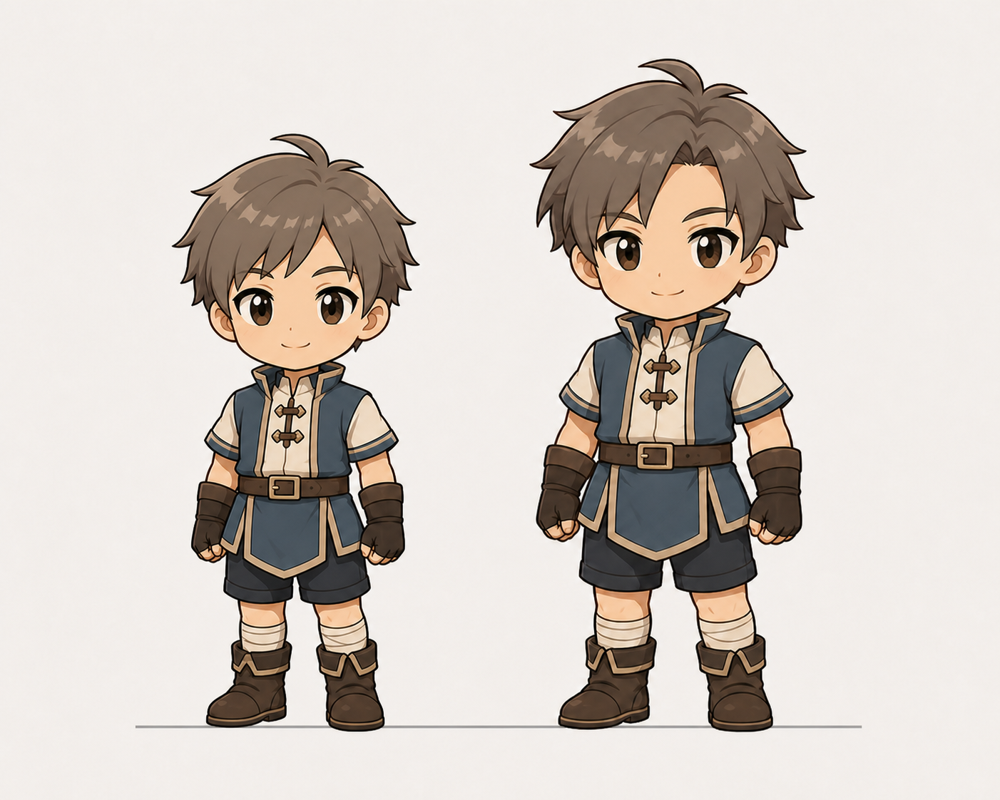

# ちびキャラの子ども組・大人組サイズ基準 たたき台 v0.2



この資料は、[共通フォーマットv0.1](chibi-character-format-draft-v1.md)へ「子ども組と大人組のサイズ差」を追加する補足仕様。

既存キャラをこの基準へ当てはめた結果は、[neutral正規化レビューv0.3](chibi-neutral-normalization-review-v3.md)を参照する。

## 結論

- 全キャラを同じ320 × 448 pxキャンバスに置く。
- 足裏の基準線は全キャラ共通で `y = 424 px` に固定する。
- ナディア、ジーンは子ども組として約2.6頭身・描画高376 pxにする。
- それ以外は大人組として約2.8頭身・描画高400 pxにする。
- 子ども組は大人組の94%程度の高さに留める。差を大きくしすぎない。
- 頭の物理サイズは両グループでほぼ同じにし、子ども組は主に胴と脚を短くする。

## グループ分け

| グループ | キャラクター | 頭身 | 01 neutralの描画高 | 頭頂の目安 | 足裏 |
| --- | --- | ---: | ---: | ---: | ---: |
| 子ども組 | ナディア、ジーン | 約2.6頭身 | 376 ± 8 px | y = 48 px前後 | y = 424 px |
| 大人組 | エスト、ユシュカ、ナジーン、グレイ、サングレイル | 約2.8頭身 | 400 ± 8 px | y = 24 px前後 | y = 424 px |

髪先、角、耳、翼は頭身計測に含めない。頭身は頭蓋上端から顎までを1単位として測る。

## 並べたときのアンカー

### 立ちポーズ

- キャンバス中心は `x = 160 px`。
- 左右の足裏が接する水平線を `y = 424 px` に置く。
- 身長差は上方向だけで表現し、子ども組を上下中央へ配置しない。
- 髪型や角で頭頂位置が変わっても、顎・肩・腰・膝の比率から頭身を判断する。

### 走る・前傾するポーズ

- 地面に接している側の足裏を `y = 424 px` に合わせる。
- 浮いている足や髪先は基準にしない。
- 前傾角は10〜15度を目安にし、頭の見かけサイズは01 neutralと揃える。

### 座る・眠るポーズ

- 足裏ではなく、クッション・床・尻などの最下接地点を `y = 424 px` に合わせる。
- 01 neutralと同じ縮尺を維持し、キャンバスへ収めるためにキャラ全体を縮小しない。
- 横幅が足りない場合は、ポーズを少し畳んで調整する。

## 頭と体の差の付け方

| 部位 | 子ども組 | 大人組 |
| --- | --- | --- |
| 頭 | 大人組とほぼ同じ物理サイズ | 共通基準 |
| 顔 | 頬を少し丸く、顎を短く | 顎と鼻筋をわずかに長くしてよい |
| 肩 | 頭幅の1.15〜1.30倍 | 頭幅の1.25〜1.45倍 |
| 胴 | やや短い | 子ども組より約8〜12%長い |
| 脚 | やや短い | 子ども組より約8〜12%長い |
| 手足 | 少し丸く簡潔 | 衣装が読める範囲で少し大きくしてよい |

性別による差より、子ども組・大人組の差を優先する。同じグループ内では頭身差を±0.1以内に抑える。

## ジェスチャーとの組み合わせ

サイズ差と性格差を混同しない。

- ナディアは子ども組だが、ジェスチャー強度3の活発な動きを使える。
- ジーンは子ども組で、ジェスチャー強度1〜2の穏やかな動きを基本にする。
- グレイは大人組で、ジェスチャー強度2〜3を使える。
- サングレイルは大人組だが、ジェスチャー強度1の控えめな動きを基本にする。

## 生成プロンプトへの追記

### 子ども組

```text
子ども組の共通フォーマット。約2.6頭身、320×448pxへ書き出す前提。
ニュートラル立ちの描画高は376px前後。足裏をy=424pxへ揃える。
大人組と頭の物理サイズはほぼ同じにし、胴と脚を短くして子どもらしさを出す。
大人組の約94%の全高に留め、幼児体形や極端なサイズ差にはしない。
```

### 大人組

```text
大人組の共通フォーマット。約2.8頭身、320×448pxへ書き出す前提。
ニュートラル立ちの描画高は400px前後。足裏をy=424pxへ揃える。
子ども組より胴と脚を少し長くするが、3頭身を超える細長い体形にはしない。
```

### 全キャラ共通

```text
同じ画面で横並びになるため、キャラクターの足元アンカーを必ず共通化する。
立ちポーズは左右の足裏、動きのあるポーズは接地している足、座り・睡眠ポーズは最下接地点をy=424pxへ置く。
頭頂ではなく足元を固定し、グループ間の高さの違いは上方向だけに出す。
```

## 実装・確認手順

1. 全キャラの01 neutralを320 × 448 pxへ仮配置する。
2. 足裏をy = 424 pxへ固定する。
3. 大人組を描画高400 pxへ揃える。
4. ナディアとジーンを描画高376 pxへ揃える。
5. 96 px相当で横並び表示し、子ども組が「少し低い」と感じる範囲か確認する。
6. 差が強すぎる場合は子ども組を384 px、弱すぎる場合は368 pxへ調整する。
7. 基準が決まってから02〜09へ同じ縮尺とアンカーを展開する。

## 現時点の推奨値

最初の実機比較は、大人組400 px・子ども組376 pxで行う。差は24 px、比率では6%。「別シリーズ」に見えず、年齢差だけが伝わる程度を狙う。
