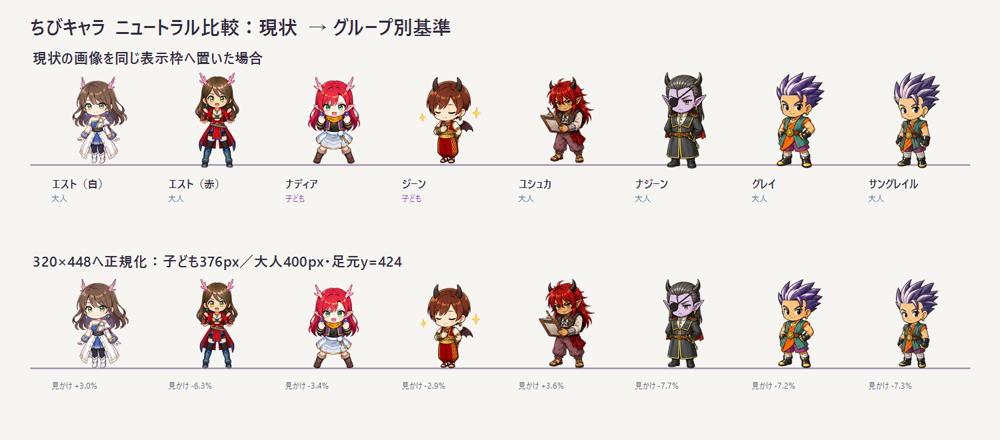

# ちびキャラ neutral正規化レビュー v0.3

## 比較条件

- 共通キャンバス：320 × 448 px
- 共通の足裏位置：`y = 424 px`
- 子ども組：ナディア、ジーン。描画高376 px
- 大人組：それ以外。描画高400 px
- 上段：現在のPNGを同じ正方形表示枠へ置いた状態
- 下段：透明部分を測定し、グループ別基準へ正規化したプレビュー
- 元のキャラクターPNGは変更していない

## 現在から必要な見かけサイズ調整

| キャラクター | グループ | 現在の見かけ高 | 基準の見かけ高 | 調整率 |
| --- | --- | ---: | ---: | ---: |
| エスト（白） | 大人 | 107.5 px | 110.7 px | +3.0% |
| エスト（赤） | 大人 | 118.1 px | 110.7 px | -6.3% |
| ナディア | 子ども | 107.7 px | 104.1 px | -3.4% |
| ジーン | 子ども | 107.1 px | 104.1 px | -2.9% |
| ユシュカ | 大人 | 106.9 px | 110.7 px | +3.6% |
| ナジーン | 大人 | 119.9 px | 110.7 px | -7.7% |
| グレイ | 大人 | 119.3 px | 110.7 px | -7.2% |
| サングレイル | 大人 | 119.4 px | 110.7 px | -7.3% |

見かけ高は、現在の124 px表示枠へ収めた場合の透明部分を除く概算値。

## 判定

### キャンバス正規化を先に行う

- ナディア
- ジーン
- ユシュカ
- ナジーン
- グレイ
- サングレイル

この6キャラは、現時点ではデザインを描き直さず、320 × 448 pxへの再配置と足元アンカー統一を先に試す。正規化後の比較で頭身差が気になるポーズだけを個別に再生成する。

### 頭身の再生成候補

- エスト（白）
- エスト（赤）

エスト2種は大人組だが、ほかの大人組より顔が柔らかく、胴と脚が短く見えやすい。まず正規化プレビューを実画面で確認し、それでも子ども組に近く見える場合だけ、キャラクターデザインを維持した約2.8頭身版を作る。

## 正規化のルール

1. 元画像の実アルファ境界を測る。
2. 透明部分を除いた描画高を、子ども376 px・大人400 pxへ合わせる。
3. 横幅は288 px以内に収める。横幅制限に当たった場合は高さより安全余白を優先する。
4. 左右中央を `x = 160 px` へ合わせる。
5. 立ちポーズの足裏を `y = 424 px` へ合わせる。
6. キャラの上下中央揃えは使用しない。
7. 輪郭線や絵柄へ補間の影響が出ないよう、最終書き出しを目視確認する。

## 次の作業

01 neutralの正規化プレビュー8種類は `normalized-neutral-preview-v3/` に作成済み。

- [エスト（白）](normalized-neutral-preview-v3/adult-est-classic-neutral.png)
- [エスト（赤）](normalized-neutral-preview-v3/adult-est-variant-neutral.png)
- [ナディア](normalized-neutral-preview-v3/child-nadia-neutral.png)
- [ジーン](normalized-neutral-preview-v3/child-jean-neutral.png)
- [ユシュカ](normalized-neutral-preview-v3/adult-yushka-neutral.png)
- [ナジーン](normalized-neutral-preview-v3/adult-najin-neutral.png)
- [グレイ](normalized-neutral-preview-v3/adult-gray-neutral.png)
- [サングレイル](normalized-neutral-preview-v3/adult-sangrail-neutral.png)

全ポーズの確認結果は [全ポーズ正規化レビュー v0.4](chibi-all-pose-normalization-review-v4.md) に続く。

次は以下の順で進める。

1. 96 px・124 pxの実表示サイズで横並び確認する。（完了）
2. 02〜09を同じキャラ倍率で走査し、再配置対象を分ける。（完了）
3. エスト2種は、正規化後も幼く見える場合だけ2.8頭身で再生成する。
4. 全ポーズ確認後にアプリ参照先を切り替える。
