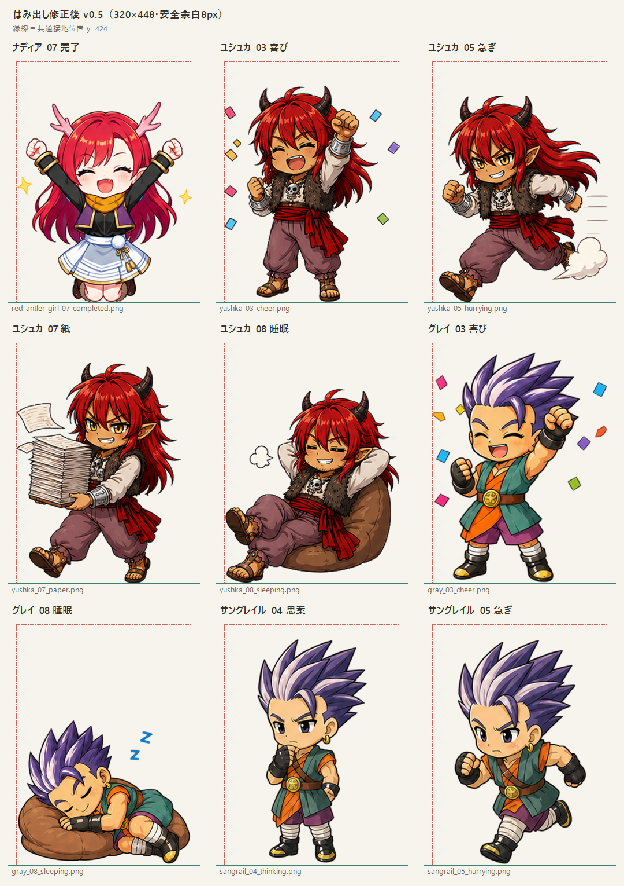

# ちびキャラはみ出し修正レビュー v0.5

## 反映内容

- 対象9枚を共通キャンバス `320 × 448 px` へ修正
- 左右・上に8 px以上の安全余白を確保
- 接地面の最下端を `y = 423 px` 以内へ統一
- 背景の透過を維持
- 人物の顔・衣装・線画・色は元画像を維持
- 紙吹雪、星、紙、煙だけを内側へ再配置
- ユシュカ・グレイの睡眠ポーズは横幅に合わせて縮小
- サングレイル04・05の画像端に残っていた不要な切れ端を除去

## 検証結果

| ファイル | 左 | 上 | 右 | 下 | 判定 |
| --- | ---: | ---: | ---: | ---: | --- |
| red_antler_girl_07_completed.png | 9 | 78 | 311 | 423 | OK |
| yushka_03_cheer.png | 8 | 50 | 311 | 423 | OK |
| yushka_05_hurrying.png | 19 | 67 | 311 | 423 | OK |
| yushka_07_paper.png | 8 | 42 | 292 | 423 | OK |
| yushka_08_sleeping.png | 8 | 86 | 310 | 423 | OK |
| gray_03_cheer.png | 8 | 24 | 310 | 423 | OK |
| gray_08_sleeping.png | 9 | 172 | 311 | 423 | OK |
| sangrail_04_thinking.png | 65 | 33 | 255 | 422 | OK |
| sangrail_05_hurrying.png | 44 | 34 | 276 | 423 | OK |

`index.html` の該当URLには `v=20260826-format-v5` を付け、PWA・Android WebViewで旧画像キャッシュが残りにくいようにした。サービスワーカーのキャッシュ名は変更していない。

