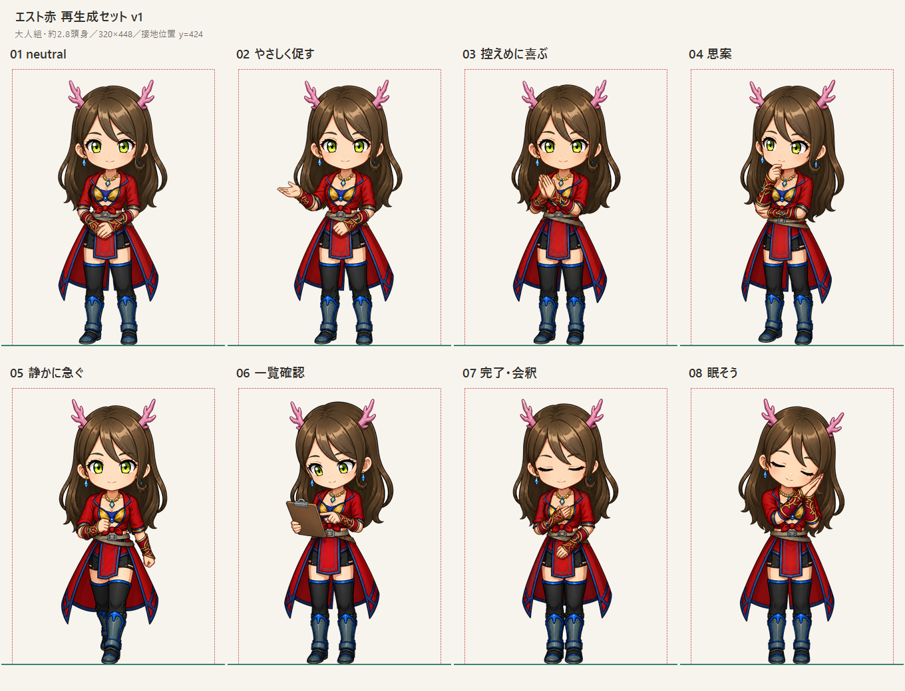
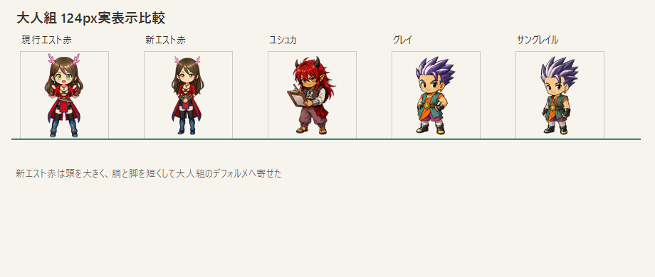

# エスト赤 再生成セット v1





## 生成方針

- 大人組テンプレ：320 × 448 px
- 描画高：約400 px
- 接地位置：最下端 `y = 423 px`、基準線 `y = 424 px`
- 頭身：約2.8頭身
- 性格：大人の控えめな女性
- 表情：穏やかで落ち着いた微笑みを中心にする
- 動作：肘と手を身体の近くに置き、親指・ガッツポーズ・両手上げ・ジャンプを使わない
- 背景：完全透過

## 参照画像の役割

- `HLwhMuVakAAvKTd.jpe`：原作のキャラクターデザイン
- 現行 `est_variant_01_neutral.png`：衣装の簡略化、配色、ちびキャラの描画スタイル
- ユシュカneutral：大人組の頭身基準だけを参照
- 新neutral：02〜08の顔、頭身、衣装、線画の固定アンカー

## ポーズ構成

| 番号 | ファイル | 内容 |
| --- | --- | --- |
| 01 | `est_variant_01_neutral.png` | 手を腰前で重ねた穏やかな立ち姿 |
| 02 | `est_variant_02_thumbsup.png` | 胸の高さまでの小さな手差し |
| 03 | `est_variant_03_cheer.png` | 胸元で控えめに手を合わせて喜ぶ |
| 04 | `est_variant_04_thinking.png` | 片手を顎に添えて静かに考える |
| 05 | `est_variant_05_hurrying.png` | 歩幅の小さい静かな早歩き |
| 06 | `est_variant_06_clipboard.png` | クリップボードを身体の近くで確認 |
| 07 | `est_variant_07_completed.png` | 胸に手を添えた小さな会釈 |
| 08 | `est_variant_08_sleeping.png` | 手を頬に添えた控えめな居眠り |

## 共通生成プロンプト

```text
Use case: identity-preserve
Asset type: PatientTriage chibi character UI sprite, one pose in a consistent 8-pose set.
Input images: Image 1 is the authoritative new chibi anchor for Est's identity, exact approximately 2.8-head adult proportions, face, hair, outfit, palette and rendering style. Image 2 is the original character-design reference for detail verification.
Subject invariants: exactly the same reserved adult woman Est as Image 1: long brown hair, small branching pink antlers, bright green eyes, red tailored coat-dress with blue piping and gold details, black lower garments, dark blue armored boots, red-gold bracers, blue earrings and blue pendant.
Style/medium: match Image 1 exactly; polished clean anime chibi game UI illustration, crisp dark line art, soft cel shading, readable at 96px.
Composition/framing: single full-body character centered; approximately 2.8 heads tall; all hair, antlers, hands and boots fully visible; generous transparent padding; feet or lowest contact point aligned to a common baseline.
Constraints: genuinely transparent background; preserve adult identity, compact head-to-body ratio, outfit and colors; restrained feminine body language; no weapon; no text; no border; no floor shadow; no decorative particles; no watermark.
Avoid: changing the character design, taller proportions, long legs, childlike toddler proportions, open-mouth exuberant grin, thumbs-up, raised fists, both arms overhead, jumping, victory pose, exaggerated action.
```

各画像では上記へポーズ固有の指示を1件だけ追加した。生成は組み込み画像生成を使用。生成画像に焼き込まれた市松背景は、外周から連続する背景領域だけを除去して透過化し、白目や装飾の白いハイライトは保持した。

