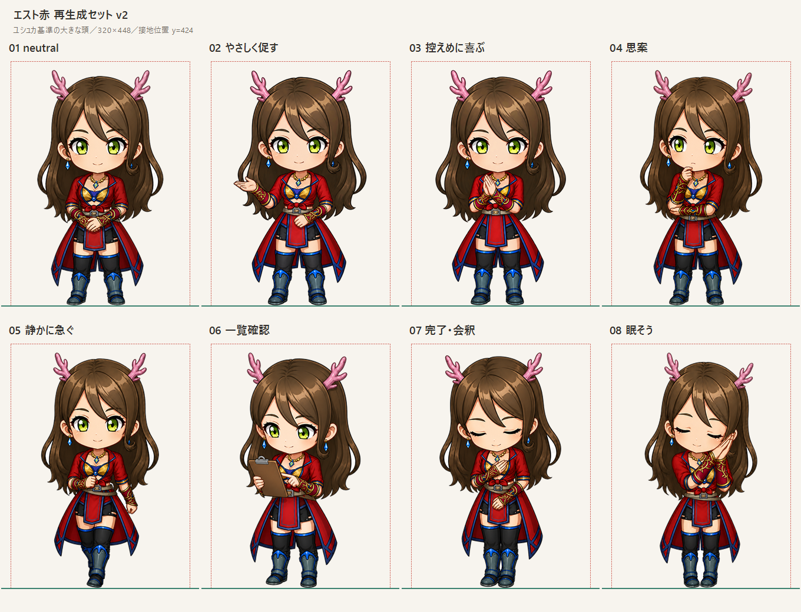
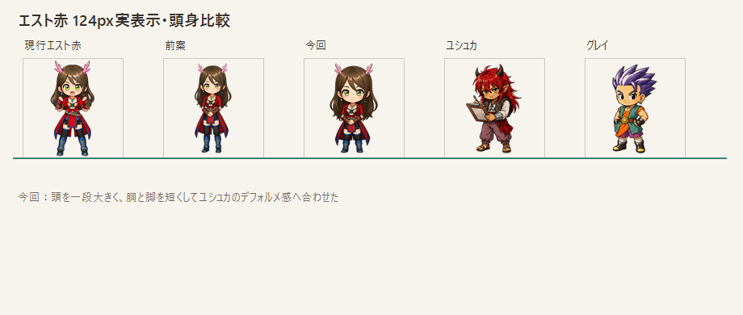

# エスト赤 再生成セット v2





## v1からの変更

- 約2.8頭身という数値基準を取りやめ、ユシュカの実際の見た目を優先
- 頭と顔を一段大きくした
- 胴、腿、すね、ブーツを短くした
- 頭身の目安を角を除いて約2.2〜2.4頭身へ変更
- 大人らしさは身体の長さではなく、表情・姿勢・控えめな手振りで維持

## 出力仕様

- 320 × 448 px
- 完全透過背景
- 左右・上に8 px以上の安全余白
- 最下端 `y = 423 px`、基準線 `y = 424 px`
- 8ポーズすべて同じ頭身と衣装

## 共通生成プロンプト

```text
Use case: identity-preserve
Asset type: PatientTriage chibi character UI sprite in a consistent 8-pose set.
Input images: Image 1 is the authoritative new Est anchor for identity, outfit, palette, rendering style, and especially the very large Yushka-like head-to-body ratio. Image 2 is only the pose and hand-placement reference; do not inherit its smaller head, longer torso or longer legs. Image 3 verifies Est's original design.
Subject invariants: same adult reserved woman Est as Image 1, with long brown hair, small branching pink antlers, green eyes, red tailored coat-dress, blue piping, gold details, black lower garments, dark blue armored boots, red-gold bracers, blue earrings and pendant.
Proportion: match Image 1 exactly, roughly 2.2–2.4 heads tall excluding antler tips; large head, short compact torso, short thighs and lower legs. Do not drift taller.
Style/medium: match Image 1 exactly; polished anime chibi game UI art, crisp dark line art and soft cel shading, readable at 96px.
Composition: one full-body character centered, all antlers/hair/hands/boots visible, generous padding, lowest contact point on one baseline.
Constraints: genuinely transparent background; adult calm demeanor; no weapon; no readable text; no border; no particles; no watermark.
Avoid: smaller head, elongated body or legs, realistic adult proportions, toddler behavior, open-mouth exuberant grin, thumbs-up, raised fists, arms overhead, jumping, victory pose.
```

生成は組み込み画像生成を使用。ポーズごとに上記へ固有動作を1件追加した。一部出力に焼き込まれた市松背景は、外周から連続する背景だけを除去して透過化した。

